# Android-Gps-APP-

### Group 0 ：Renyu Jiang, Chenbo Zhang, Jiawei Zhao, Yiqin Zhang

An Android GPS reading application that reads data from a GPS sensor tells you about your latitude and longitude, height, travel distance, and using time information. It provide a friendly user interface with [Google Maps](https://www.google.com/maps) to show the user's travels on a map. Besides, it supports matrices change, high score recording, and historical data storage. It is an excellent tool for getting and recording your travel measurement.

# Table of contents

- [Android-Gps-APP-](#android-gps-app-)

- [Table of contents](#table-of-contents)

- [How to use](#how-to-use)

  - [Basic Function](#basic-function)
    - [Metric change](#metric-change)
    - [High Score](#high-score)
    - [Reset](#reset)
    - [Historical Data](#historical-data)
    - [Moving time](#moving-time)
  - [Change speed color](#change-speed-color)
  - [Kalman Filter](#kalman-filter)
  - [View acceleration](#view-acceleration)
  - [Export feature](#export-feature )

  

# How to use

## Basic Function

Add a friendly interface with Google Maps to show the user's trajectory on a map. Record location (latitude, longitude) and speed when you press start, and it accumulates traveling time. You can check the "help" button for more information about using this app.

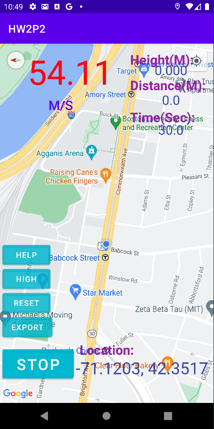

*Basic display of speed, location, height, distance and time.*

### Metric change

Press any measurement to change metric.

For example, Time(Sec) can be change to Time(Min), Time(Hour) and Time(Day).

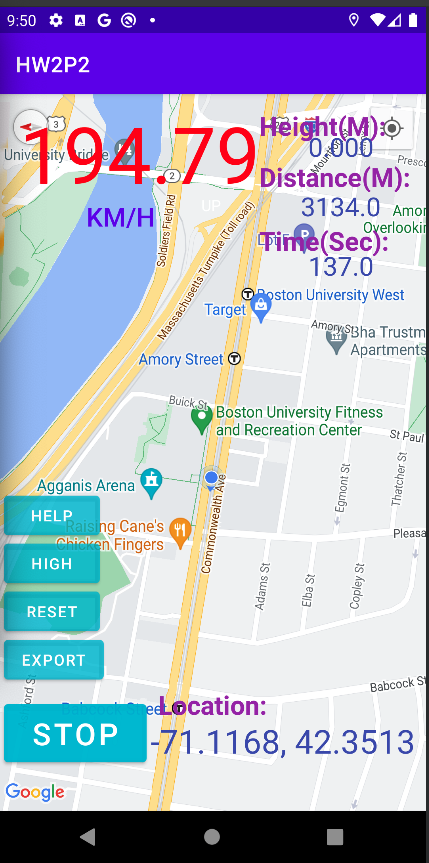

*Alternative matric display in KM/H.*

## High Score

Enter high score page by pressing "High" button. In this page you can see the maximum and minimum historical data.

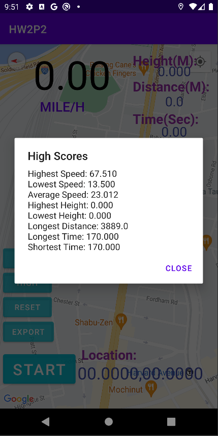

*High Score pannel*

## Reset

Hit "Reset" button to reset all measurement, including High Score page. Reset will not clear Moving time for it is set to record all time movement. 

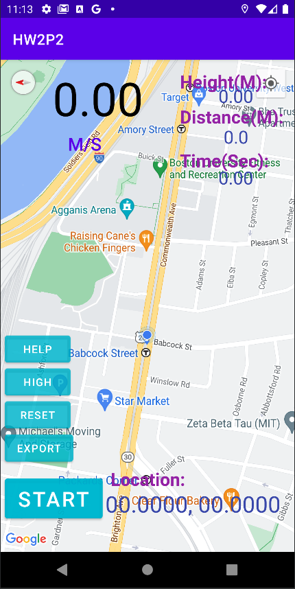

## Historical Data

Historical data will be stored in OnDestory() method. Encryption will be considered in further development for privacy and security purpose.

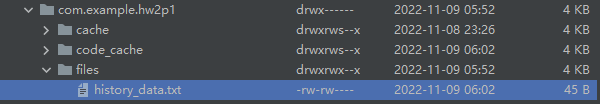

## Moving time

Moving time increase every second if your speed is non-zero.

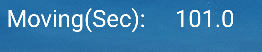

*Moving Time*

## Change speed color

Change the speed color to green when it is lower than the historical average, and red when it is higher than the historical average. 

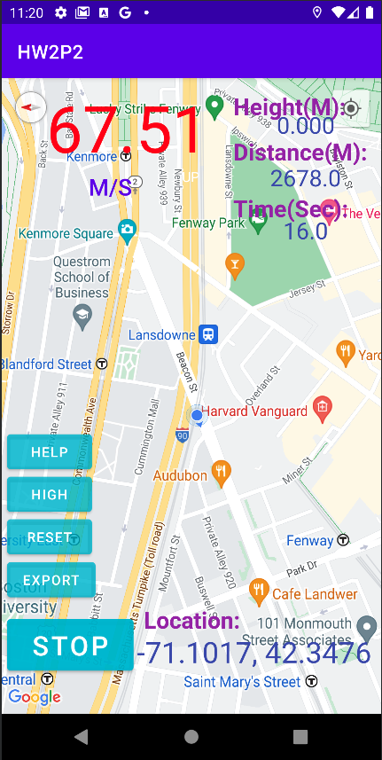

*Speed color change to red when speed is higher than average.*

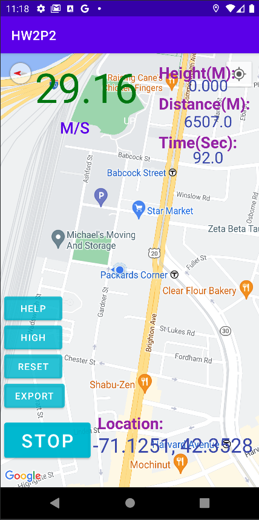

*Speed color change to green when speed is lower than average.*

## Kalman Filter
We added a Kalman filter to smooth the speed.

Kalman filter is a time domain filter based on discrete linear dynamics system. It is introduced because sensors only gives approximate value, with may cause system perturbed by errors.

Kalman filter predict current system status by previous state, state-transition model, the observation model, process noise, observation noise, control vector and current sensor reading.

For each time step k, we shall have:
 - $x_{k-1}$, the previous state;
 - $z_k$, the reading of sensor at k;
 - $F_k$, the state-transition model
 - $H_k$, the observation model;
 - $Q_k$, the covariance of the process noise;
 - $R_k$, the covariance of the observation noise;
 - $B_k$ (Optional), the control-input model; if Bk is included, then there is also
 - $u_k$, the control vector, representing the controlling input into control-input model.

It use previous state to calculate priori prediction and combine it with current sensor reading.
We have:

$x_{priori} = F_k x_{k-1}$

and covariance 

$P = F_k P_{k-1}F_k^T + Q_k$

Then it calculate Kalman gain $K$ and use current sensor reading to predict real $x_k$.

$K = P H^T (HPH^T + R_k)^{-1}$

$x_k = x_{priori} + K (z_k - H x_{priori})$

In our situation, we have state-transition model and the observation model equal to 1, for we are predicting only speed, and we don't have control input, so control input model is not needed.

Noise is generated by java.util.Random as gaussian noise to simulate real situation.

## View acceleration

## Export feature 

Export various recorded measurements and send data to a provided email address. Applied the Android Sharesheet and Intent to send simple data to Email. Click "export" and choose Gmail, then log in to the Gmail account to send the Email with recorded data. 

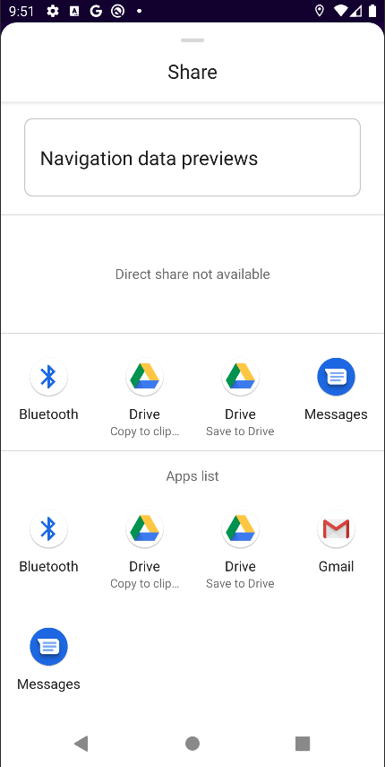

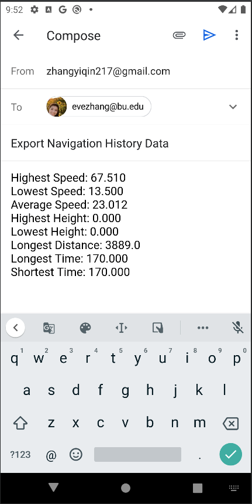

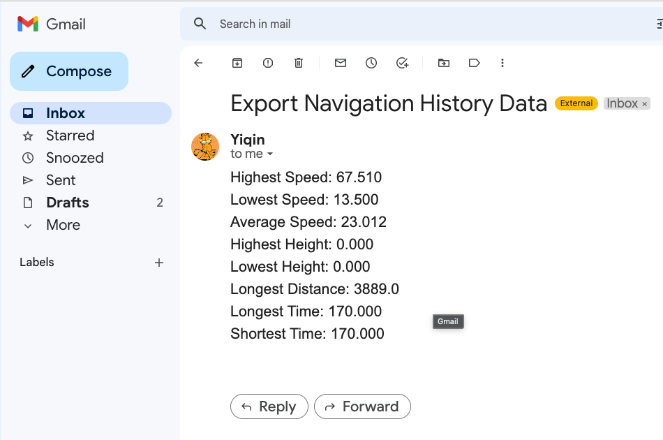

# Individual Feature

### P1:

Renyu Jiang: Maintain measurement data throughout the application lifecycle, Add qualitative indicators on existing metrics as to whether they are currently increasing or decreasing

Yiqin Zhang: Provide a "high scores" page that notes the highest and lowest values of the various metrics since the last reset

Jiawei Zhao: Implement a Reset button that allows the user to reset some or all of the accumulated metrics

Chenbo Zhang: Provide a "moving time" metric that records the amount of time during which the device has been moving

### P2:

Renyu Jiang: Add the ability to view the instantaneous acceleration of the device, in a variety of units.

Yiqin Zhang: Add an "export" feature that sends your various recorded measurements in a usable format to a provided email address.

Jiawei Zhao: Change the speed color to green when it is lower than the historical average, and red when it is higher than the historical average. 

Chenbo Zhang: Add a Kalman Filter to smooth out speed estimates over time.

